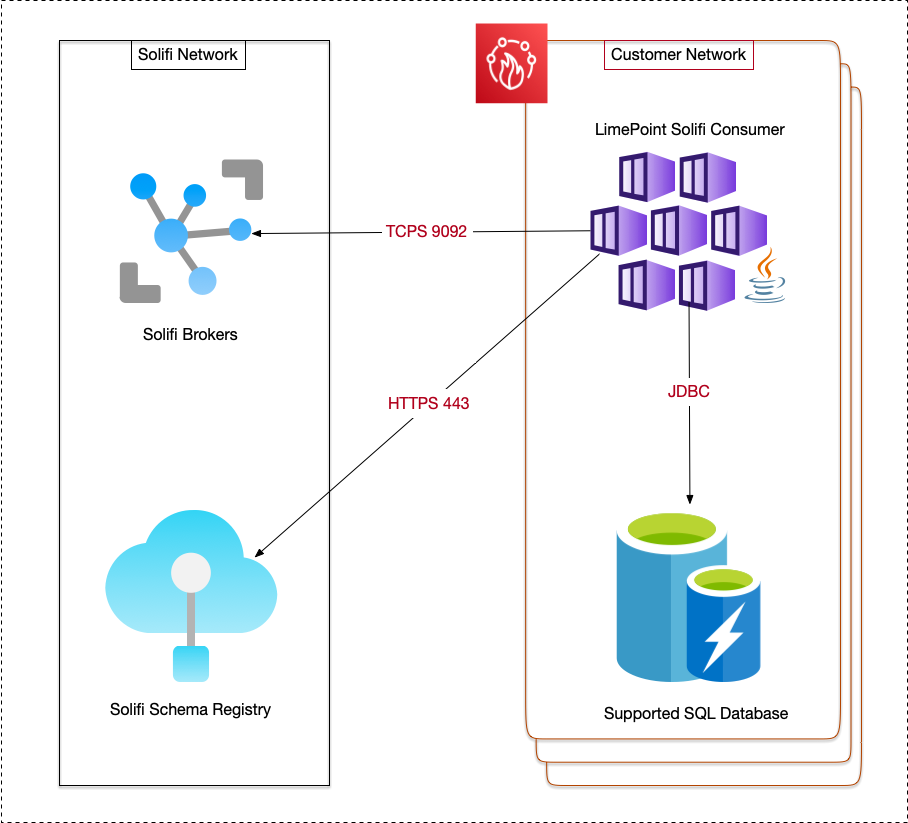
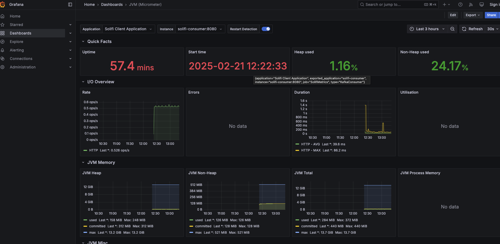
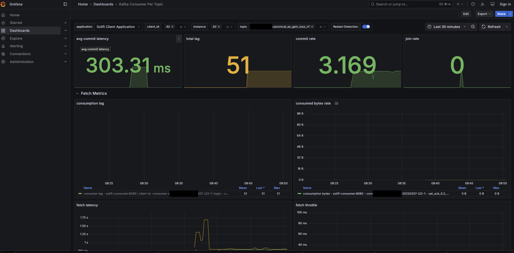

# LimePoint Solifi Consumer


<!-- TOC -->
* [LimePoint Solifi Consumer](#limePoint-solifi-consumer)
  * [Change Log](#change-log)
    * [Release 2.0.7](#release-207)
    * [Release 2.0.6](#release-206)
    * [Release 2.0.5](#release-205)
    * [Release 2.0.4](#release-204)
    * [Release 2.0.3](#release-203)
    * [Release 2.0.2](#release-202)
    * [Release 2.0.1](#release-201)
  * [Overview](#overview)
  * [Network Diagram](#network-diagram)
  * [Supported Deployment Methods](#supported-deployment-methods)
  * [Supported Backend Databases](#supported-backend-databases)
  * [Access To LimePoint Support](#access-to-limepoint-support)
  * [Java Version Support](#java-version-support)
  * [Anatomy Of The Consumer](#anatomy-of-the-consumer)
    * [The Consumer Application](#the-consumer-application)
    * [Understanding Application.yml File](#understanding-applicationyml-file)
    * [Sample Application.yml To Read All Topics](#sample-applicationyml-to-read-all-topics)
    * [Sample Application.yml Using Environment Variables](#sample-applicationyml-using-environment-variables)
    * [Sample Application.yml To Read Topics Matching A Pattern](#sample-applicationyml-to-read-topics-matching-a-pattern)
    * [Sample Application.yml To Read Explicitly Defined Topics](#sample-applicationyml-to-read-explicitly-defined-topics)
    * [Sample Application.yml To Store Tables Under Custom Schema in MSSQL](#sample-applicationyml-to-store-tables-under-custom-schema-in-mssql)
    * [Sample Application.yml To Use Regex To Map Topics to Table Names](#sample-applicationyml-to-use-regex-to-map-topics-to-table-names)
  * [Health Monitoring](#health-monitoring)
  * [Deployment Methods](#deployment-methods)
    * [Deploying Standalone](#deploying-standalone)
    * [Deploying As Docker Container](#deploying-as-docker-container)
    * [Deploying on Azure Kubernetes (AKS)](#deploying-on-azure-kubernetes-aks)
        * [Create ConfigMaps](#create-configmaps)
        * [Create Deployment](#create-deployment)
        * [Validate Container Logs](#validate-container-logs)
        * [References](#references)
    * [Deploying on ECS](#deploying-on-ecs)
    * [Deploying on K8s](#deploying-on-k8s)
  * [Advanced Deployment Methods](#advanced-deployment-methods)
    * [Running Multiple Consumers](#running-multiple-consumers)
    * [Running Consumers in Different environments](#running-consumers-in-different-environments)
  * [Handling Date & Time](#handling-date--time)
  * [Scaling Consumer Application](#scaling-consumer-application)
  * [Error Handling](#error-handling)
  * [Auditing](#auditing)
    * [How Auditing Works](#how-auditing-works)
    * [Important Considerations When Enabling Auditing](#important-considerations-when-enabling-auditing)
<!-- TOC -->

## Change Log

### Release 2.0.7

Bug Fixes
- Fixed an issue with date columns not being recognized correctly if the schema has `long` type marked against the column. This only happens for clients who have not yet migrated to the `v2` version of the topics. Customer might notice `Updating Optional DATE schema from 'long' to 'int' for <column_name>` messages in their logs which can be ignored. This message is purposely set to `info` level to indicate that the table has invalid schema. 

### Release 2.0.6

Enhancements
- Added support monitoring via Prometheus endpoint. The consumer now exposes a `/actuator/prometheus` endpoint to hook into any external Prometheus system. Refer [Health Monitoring](#health-monitoring)


### Release 2.0.5

Enhancements
- Added support for using Regex to manage table to topic mappings. This enables clients to remove the prefixes in topic names via the property `solifi.topic-table-mapping` enables that. Refer [Sample Application.yml To Use Regex To Map Topics to Table Names](#sample-applicationyml-to-use-regex-to-map-topics-to-table-names)


### Release 2.0.4

Enhancements
- Added support for overriding the default schema used when creating tables in a MSSQL server. The property `solifi.default-db-schema-name` defaults to `dbo` when not specified. Refer [Sample Application.yml To Store Tables Under Custom Schema in MSSQL](#sample-applicationyml-to-store-tables-under-custom-schema-in-mssql)

### Release 2.0.3

Introduced a new property `topics-regex` which when set will use a regex pattern matching to automatically look up topics matching the pattern. This saves writing down every topic you want to consume in the `application.yml` file. The default value for this property is set to `.*` and thus would read every topic available. The consumer periodically checks (every 5 mins) for topic list. With this feature, you no longer have to restart your consumer everytime you want to add a new topic. Once the topic is published/available upstream, the consumer should start reading that topic within 5 mins. If `topics-regex` and `topics` are both specified, `topics` takes precedence. If none are specified, `topics-regex` takes precedence. 

### Release 2.0.2

Updated the auditing tables to add a prefix of `lp_` for the columns so as to not conflict with other database columns.

### Release 2.0.1

#### Architecture Changes

Version 1 of the consumer relied on SQL files to manage database tables. This approach had some key limitations, as any schema changes in the upstream Solifi broker required us to release a new version of the consumer to stay aligned. From version 2.x onward, we restructured how schema changes are handled. Instead of shipping SQL files, the consumer now detects the required schemas from the Schema Registry and dynamically creates or updates tables in the backend database.

When running the consumer for the first time, you might see errors in the logs related to table creation. These can be safely ignored, as they are caused by multiple threads attempting to create the same table simultaneously.

---

## Overview

LimePoint Solifi Consumer is a Kafka Consumer that allows customers to read messages from Solifi brokers and persist it in the database of choice. The consumer is generic and can be used by any customer using Solifi services and allows modifications via configuration files.

The consumer provides the following functionalities:

1. No code approach to consume Solifi generated messages.
2. Support for deploying as a standalone application or on a container platform of choice.
3. Running multiple consumers to scale up message consumption.
4. Support for multiple backend databases.
5. Access to LimePoint Support Portal.
6. Free consumer upgrades when changes occur in upstream Solifi.

---

## Network Diagram



---

## Supported Deployment Methods
The consumer can be deployed as a standalone Java application or as a container.

---

## Supported Backend Databases
The consumer can persist messages to the following databases, these can be either on-prem or as PaaS.

1. Postgres SQL
2. Microsoft SQL
3. MySQL
4. MariaDB
5. Oracle Database

You must provide a user that can create/update database schemas in the database. The consumer comes pre-built with schema information and manages it automatically.

---

## Access To LimePoint Support
To get access to any issues related to the workings of the consumer, customers should raise a ticket at https://support.limepoint.com. Speak to your account manager on how to get access or drop an email at support@limepoint.com

---

## Java Version Support
The consumer is supported with the following Java versions:

1. OpenJDK 17

---

## Anatomy Of The Consumer
The consumer artefact consists for three important files which are all required for it to function properly, viz.

1. The Java archive (solifi-consumer-<version>.jar)
2. A license files (license.license and signature file)
3. A sample application.yml file

### The Consumer Application
The consumer application includes built-in functionality to manage backend database schemas. It automatically creates a table for each topic and, if needed, an accompanying audit table. The tables are adjusted based on the messages received. However, the consumer only creates or modifies tables for the topics specified in the application.yml file. For example, while the ILS application may have over 600 topics, if only 10 topics are listed in your application.yml file, the consumer will create tables for just those 10 topics.

### Understanding Application.yml File
The behavior of the consumer is configured through the application.yml file. This file instructs the consumer on which brokers to read data from, which backend database to persist the data to, how many threads to run, and more. You can remove any configurations that are not relevant to your use case from the application.yaml. The sample below demonstrates all the currently supported configuration options. Any field marked as optional can be left out. You can also replace the value of any field with an environment variable.

```yml
spring:
  kafka:
    consumer:
      group-id: # e.g. myabc-consumer-1; Enter  your consumer group ID here. You can get this information from your Solifi representative. We encourage to use a new group ID to support correct E2E testing. Using an existing group ID could cause no data, because data offsets could be already read and committed from another application.
    bootstrap-servers: # e.g. pkc-89hc.ap-southeast-2.aws.confluent.cloud:9092; This is the address of your Solifi brokers. You can get this information from your Solifi representative. 
    properties:
      schema:
        registry:
          url: # e.g. https://myabc-123.ap-southeast-2.aws.confluent.cloud; This is the address of your schema registry. You can get this information from your Solifi representative. 
          basic.auth.user.info: API-KEY:API-SECRET # e.g. AOI8hCTKKA:51m2VSl0yn3515ixYLJN7S0ykawEMo5qtm2E2; Credentials to connect to the schema registry. This is the address of your schema registry. You can get this information from your Solifi representative.
      security.protocol: SASL_SSL
      sasl.jaas.config: org.apache.kafka.common.security.plain.PlainLoginModule required username="API-KEY" password="API-SECRET"; # e.g You must enter your username and password for Kakfa here. You can get this information from your Solifi representative.
      #partition.assignment.strategy: # This is optional. Will default to RangeAssignor if not provided. eg: org.apache.kafka.clients.consumer.RoundRobinAssignor, org.apache.kafka.clients.consumer.StickyAssignor, org.apache.kafka.clients.consumer.RangeAssignor
  # Datasources control where the messages are stored in the backend. Atleast one backend source must be specified.
  datasource:
    ## Microsoft SQL
    #url: <sql server names>
    #driver-class-name: com.microsoft.sqlserver.jdbc.SQLServerDriver
    #username: <sql username>
    #password: <sql password>
    ## H2
    #url: jdbc:h2:mem:test
    #driver-class-name: org.h2.Driver
    #username: sa
    #password:     
    ## PostgreSQL
    #url: jdbc:postgresql://192.156.31.82:5432/solifidb
    #driver-class-name: org.postgresql.Driver
    #username: postgres
    #password: postgres
    ## MySql
    #url: jdbc:mysql://192.168.29.82:3306/solifidb
    #driver-class-name: com.mysql.cj.jdbc.Driver
    #username: root
    #password: mysql    
    ## Oracle
    #url: jdbc:oracle:thin:@192.156.31.82:1521/XE
    #driver-class-name: oracle.jdbc.OracleDriver
    #username: sys as sysdba
    #password: Oracle123$    
    ## Maria DB
    #url: jdbc:mariadb://192.156.31.82:3304/solifidb
    #driver-class-name: org.mariadb.jdbc.Driver
    #username: root
    #password: mariadb123
logging: # Optional. # The consumer by default uses the log level of INFO. You can change that behavior via the following property. Please be aware that if you change the log level to DEBUG, the consumer will log records in clear text. Those records may contain sensitive data. It is therefore advised to use the DEBUG mode only sparingly.
  level:
    com.limepoint.solifi: DEBUG

solifi:
  prefix: # Required. Client prefix for Solifi brokers. e.g. uat.myabc.ILS.canonical. You would get this information from Solifi.
  suffix: _v2 # Optional. if specified, consumer will remove the `_v2` from the name of the topic and create the table without it. e.g. if the topic name is addl_lessor_nf_v2, the table will be created as addl_lessor_nf
  topics-regex: # Optional. If specfied, consumer constructs the list of topics to listen to based on the regex. Defaults to '.*' which means it will read all topics that begin with the value specified via the 'prefix' property. If topics-regex and topics are both specified, topics takes precedence. If none are specified, topics-regex takes precedence. E.g. to read only topics starting with addl, use 'addl.*'. This property supports any regex pattern supported by Java.
  topic-table-mapping: # Optional. If specified, matches the names of the topics with the match property and replaces it with the replace property. E.g. if you have topics uat.client.FMO.canonical.calms-app_asset_other_charge and want the table name to be app_asset_other_charge as opposed to calms-app_asset_other_charge, you can use the following:
    - match: "uat.client.FMO.canonical.*-"
      replace: ""
  topics: # Optional. List of topics client wishes to consume from Solifi brokers. Note that the topic names must not have any prefix. The format is <topic_name>:<table_name>:<audit_table_name>. Everything except <topic_name> is optional.
    - addl_lessor_nf
    - cs_master_nf
    - address_nf
  audit: # Optional.
    enabled: true # Optional. defaults to false. Setting it to true will create audit tables. See what audit tables do later in the document.
    include-all: true # default true. If enabled is set to true, consumer will create audit tables for all topics listed under topics heading.
    audit-suffix: _audit # the suffix value to be used when creating audit tables, e.g. this will create a audit table named addl_lessor_nf_audit.
  concurrency: 5 # Optional. This dicates number of listener threads per consumer. It defaults to the server it is running on (usually 8 or 10). For better performance this should be equal to the topic partition count but most of the customers use the default value.
  default-db-schema-name: # Optional, only used when the backend db is MSSQL. Defaults to dbo if not specified.
  license:
    path: # Path of the license file provided by LimePoint.
    signature:
      path: # Path of the signature file provided by LimePoint.
  timezone: # Optional. TZ identifier in TZDB. Refer: https://en.wikipedia.org/wiki/List_of_tz_database_time_zones. If not present, all date and time are stored in UTC. If present, values are stored by converting them from UTC to the specified value. Remember that we don't store the Timezone value in the database. The date/time will either be in UTC or converted to the TZ. We recommend keeping all values in UTC and not specify this property.
server: # Optional. Specifies the port the consumer should expose for monitoring and other statistics.
  port: 8080
```

### Sample Application.yml To Read All Topics

Here's a sample `application.yml` file reading all topics that begin with `uat.client.ILS.canonical` (prefix) from a cluster and stores them in a MS SQL database.

```yml
solifi:
  prefix: uat.client.ILS.canonical
  audit:
    enabled: true
  license:
    path: /license.license
    signature:
      path: /sign256.sign
spring:
  kafka:
    consumer:
      group-id: clientname-dev
    bootstrap-servers: bootstrap-server-hostname:9092
    properties:
      schema:
        registry:
          url: https://registry-server-hostname
          basic.auth.user.info: REGISTRY_USERNAME:REGISTRY_PASSWORD
      security.protocol: SASL_SSL
      sasl.jaas.config: org.apache.kafka.common.security.plain.PlainLoginModule   required username='BROKER_USERNAME'   password='BROKER_PASSWORD';
  datasource:
    url: jdbc:sqlserver://mssqldb-ac-uat-sink:1433;database=master;encrypt=true;trustServerCertificate=true;
    driver-class-name: com.microsoft.sqlserver.jdbc.SQLServerDriver
    username: admin
    password: password
```

### Sample Application.yml Using Environment Variables

Here's a sample `application.yml` file reading all topics that begin with `uat.client.ILS.canonical` (prefix) from a cluster and stores them in a MS SQL database but instead of hard coding the values of credentials, uses environment variables instead. You can use whatever name you want for the environment variable.

```yml
solifi:
  prefix: uat.client.ILS.canonical
  audit:
    enabled: true
  license:
    path: /license.license
    signature:
      path: /sign256.sign
spring:
  kafka:
    consumer:
      group-id: clientname-dev
    bootstrap-servers: ${SOLIFI_BOOTSTRAP_SERVERS} # e.g. bootstrap-server-hostname:9092
    properties:
      schema:
        registry:
          url: https://registry-server-hostname
          basic.auth.user.info: ${SOLIFI_REGISTRY_USERNAME}:${${SOLIFI_REGISTRY_PASSWORD}} # e.g. REGISTRY_USERNAME:REGISTRY_PASSWORD
      security.protocol: SASL_SSL
      sasl.jaas.config: org.apache.kafka.common.security.plain.PlainLoginModule required username=${SOLIFI_BROKER_USERNAME}   password=$SOLIFI_BROKER_PASSWORD};
  datasource:
    url: jdbc:sqlserver://mssqldb-ac-uat-sink:1433;database=master;encrypt=true;trustServerCertificate=true;
    driver-class-name: com.microsoft.sqlserver.jdbc.SQLServerDriver
    username: ${SOLIFI_DATABASE_USERNAME}
    password: ${SOLIFI_DATABASE_PASSWORD}
```

You **must** export the variables before you start the consumer else they will default to empty values. You can export them on the command line or if using docker in the `compose.yml` file or in K8s environment variables.

### Sample Application.yml To Read Topics Matching A Pattern

Here's a sample `application.yml` file reading all topics that begin with `uat.client.ILS.canonical` (prefix) and start with `cs_` (topics-regex) from a cluster and stores them in a MS SQL database.

```yml
solifi:
  prefix: uat.client.ILS.canonical
  topics-regex: cs_.*
  audit:
    enabled: true
  license:
    path: /license.license
    signature:
      path: /sign256.sign
spring:
  kafka:
    consumer:
      group-id: clientname-dev
    bootstrap-servers: bootstrap-server-hostname:9092
    properties:
      schema:
        registry:
          url: https://registry-server-hostname
          basic.auth.user.info: REGISTRY_USERNAME:REGISTRY_PASSWORD
      security.protocol: SASL_SSL
      sasl.jaas.config: org.apache.kafka.common.security.plain.PlainLoginModule   required username='BROKER_USERNAME'   password='BROKER_PASSWORD';
  datasource:
    url: jdbc:sqlserver://mssqldb-ac-uat-sink:1433;database=master;encrypt=true;trustServerCertificate=true;
    driver-class-name: com.microsoft.sqlserver.jdbc.SQLServerDriver
    username: admin
    password: password
```

### Sample Application.yml To Read Explicitly Defined Topics

Here's a sample `application.yml` file reading a set number of topics from a cluster and stores them in a MS SQL database.

```yml
solifi:
  prefix: uat.client.ILS.canonical
  topics:
    - cs_master_nf
    - as_addl_nf
  audit:
    enabled: true
  license:
    path: /license.license
    signature:
      path: /sign256.sign
spring:
  kafka:
    consumer:
      group-id: clientname-dev
    bootstrap-servers: bootstrap-server-hostname:9092
    properties:
      schema:
        registry:
          url: https://registry-server-hostname
          basic.auth.user.info: REGISTRY_USERNAME:REGISTRY_PASSWORD
      security.protocol: SASL_SSL
      sasl.jaas.config: org.apache.kafka.common.security.plain.PlainLoginModule   required username='BROKER_USERNAME'   password='BROKER_PASSWORD';
  datasource:
    url: jdbc:sqlserver://mssqldb-ac-uat-sink:1433;database=master;encrypt=true;trustServerCertificate=true;
    driver-class-name: com.microsoft.sqlserver.jdbc.SQLServerDriver
    username: admin
    password: password
```

### Sample Application.yml To Store Tables Under Custom Schema in MSSQL

Here's a sample `application.yml` file reading all topics that begin with `uat.client.ILS.canonical` (prefix) from a cluster and stores them in a MS SQL database under a non-default (dbo) schema. In the example below, all tables are created under `ils`. This assumes that you have created the custom database, the relevant users and schemas upfront. Notice the use of property `default-db-schema-name`.

```yml
solifi:
  prefix: uat.client.ILS.canonical
  default-db-schema-name: ils
  audit:
    enabled: true
  license:
    path: /license.license
    signature:
      path: /sign256.sign
spring:
  kafka:
    consumer:
      group-id: clientname-dev
    bootstrap-servers: bootstrap-server-hostname:9092
    properties:
      schema:
        registry:
          url: https://registry-server-hostname
          basic.auth.user.info: REGISTRY_USERNAME:REGISTRY_PASSWORD
      security.protocol: SASL_SSL
      sasl.jaas.config: org.apache.kafka.common.security.plain.PlainLoginModule   required username='BROKER_USERNAME'   password='BROKER_PASSWORD';
  datasource:
    url: jdbc:sqlserver://mssqldb-ac-uat-sink:1433;database=ils;encrypt=true;trustServerCertificate=true;
    driver-class-name: com.microsoft.sqlserver.jdbc.SQLServerDriver
    username: admin
    password: password
```

### Sample Application.yml To Use Regex To Map Topics to Table Names

Here's a sample `application.yml` file reading all topics that begin with `uat.client.FMO.canonical` (prefix) from a cluster and stores them in a MS SQL database. In the example below, the tables created in the database are different to the name of the topics that match the criterion. E.g. The name of the topics under FMO can be `uat.client.FMO.canonical.calms-app_quote` or `uat.client.FMO.canonical.catalog-catalog_model` which by default would result in the name of the table as `calms-app_quote` and `catalog-catalog_model`. If you do not want the table names to have the prefix of `calms-` or `catalog-`, you can use the property `topic-table-mapping` to define those rules. The property `topic-table-mapping` is only used for mapping topic names to table names. It does not direct the consumer or control how many topics are fetched from the broker. The `match` property takes any valid Java regex. The `replace` property can be any valid string. The `match` property matches the topic names and will replace it with the property `replace`.

```yml
solifi:
  prefix: uat.client.FMO.canonical
  topic-table-mapping:
    - match: "uat.client.FMO.canonical.*-"
      replace: ""
  audit:
    enabled: true
  license:
    path: /license.license
    signature:
      path: /sign256.sign
spring:
  kafka:
    consumer:
      group-id: clientname-dev
    bootstrap-servers: bootstrap-server-hostname:9092
    properties:
      schema:
        registry:
          url: https://registry-server-hostname
          basic.auth.user.info: REGISTRY_USERNAME:REGISTRY_PASSWORD
      security.protocol: SASL_SSL
      sasl.jaas.config: org.apache.kafka.common.security.plain.PlainLoginModule   required username='BROKER_USERNAME'   password='BROKER_PASSWORD';
  datasource:
    url: jdbc:sqlserver://mssqldb-ac-uat-sink:1433;database=ils;encrypt=true;trustServerCertificate=true;
    driver-class-name: com.microsoft.sqlserver.jdbc.SQLServerDriver
    username: admin
    password: password
```

---

## Health Monitoring

The consumer exposes a bunch of endpoints for health check and statistics, some of the key endpoints are as below:

| URI                | Description |
|--------------------------|----------------------|
| /actuator/info           | Shows/returns the version of the Consumer and License information   |
| /actuator/health         | Shows/returns the health of the consumer |
| /actuator/metrics/<metric_name> | Shows/returns the value of the specified metric. You can hit /actuator/metrics to see the list of metrics available. |
| /actuator                | Shows all endpoints available. |
| /actuator/prometheus     | Exposes a Prometheus endpoint. |
|     

The URIs can be accessed depending on the hosted platform, e.g. when hosting on docker and exposing port 8080, the above endpoints can be accessed via http://localhost:8080/actuator.

You can create Grafana dashboards using samples provided at [LimePoint Solifi Consumer Examples](https://github.com/LimePoint/limepoint-solifi-consumer-examples)

The dashboards provide insights into jvm metrics along with consumer metrics and you can customize as per requirements.





---

## Deployment Methods

You must have your license file ready and the application.yml file ready before you start the deployment.

### Deploying Standalone

To deploy as a standalone application:

* Download the latest solifi-consumer-<version>.jar. Reach out to LimePoint Support on how to get access.
* Place the application.yml in the same folder as the jar.
* Place the license.enc file in a desired folder and update the path in the application.yml.
* Make sure you are in the same folder as the jar file and application.yml file and run the jar file using the below command. This will start the application and create the database tables and start consuming from the kafka topics specified under _solifi.topics_ config.

````bash
java -jar solifi-consumer-<version>.jar
````

### Deploying As Docker Container

To deploy the consumer as a container, you must have access to LimePoint's docker hub. Please reach out to LimePoint Support to get your access. Once you have access to the repositories, login and pull the image.
```bash
docker login -u <username_provided_by_limepoint_support> # Use the password provided by support when prompted
docker image pull limepoint/solifi-consumer:<version>
```

To run in a docker container, a docker compose file needs to be created. Make sure the application configs are placed correctly where the application could read and the paths in the configs are updated in the correct path formats. Below is a sample docker file that starts the consumer and an MSSQL database. You can remove the MSSQL database if you have your own DB. Ensure that you have specified the correct details for the database in application.yml for the consumer.
````
services:
  solifi-consumer:
    image: limepoint/solifi-consumer:2.0.1 # replace with version
    networks:
      - lp_sol_demo
    volumes:
      - ./application.yml:/application.yml
      - ./license.license:/license.license
      - ./sign256.sign:/sign256.sign
    environment:
      - spring.config.additional-location=/application.yml
      - JAVA_OPTS=-XX:MaxDirectMemorySize=64m
    ports:
      - "8080:8080" # ports to expose, must match the second port in application.yml
    depends_on:
      mssqldb:
        condition: service_healthy
  mssqldb:
    image: mcr.microsoft.com/mssql/server:2022-latest
    hostname: mssqldb
    container_name: mssqldb
    ports:
      - "1440:1433"
    environment:
      ACCEPT_EULA: 1
      MSSQL_SA_PASSWORD: Welcome123$
    networks:
      - sol_demo
    healthcheck:
      test: ["CMD", "echo", ">", "/dev/tcp/mssqldb/1433"]
      interval: 10s
      retries: 3
      start_period: 30s
      timeout: 5s
networks:
  sol_demo:
    name: sol_demo

````

Start-up the docker container using, 
````
docker compose up -d
````

---

### Deploying on Azure Kubernetes (AKS)

To deploy to AKS, you must first create the required infrastructure. For example, you must create the AKS cluster. If you are planning to use MS SQL, you must also create the database services. 

Since the consumer requires `application.yml` and `license` files to function correctly, you must make provisions for the Consumer to read those configurations. One way to do that is to make use of `configMaps`. 

#### Create ConfigMaps
Use the following commands to create configMaps to store the contents of the license file and the application.yml file.
````
kubectl create configmap consumer-config --from-file=application.yml --from-file=license.license --from-file=sign256.sign 
kubectl describe configmaps consumer-config
kubectl edit configmap -n <namespace> <configMapName> -o yml

# apply update to ConfigMap using dry-run and replace
kubectl create configmap consumer-config  --from-file=license.license --from-file=sign256.sign --from-file=application.yml -o yml --dry-run=client | kubectl replace -f -
````

#### Create Deployment
You must now create the `deployment.yml` to allow AKS to deploy your configurations.
````
apiVersion : apps/v1
kind: Deployment
metadata:
  name: solificonsumer # name of the deployment 
spec:
  replicas: 1
  selector:
    matchLabels: # Match all pods with the defined labels
      app: solificonsumer
  template: # deployemnt wraps a pod. Defines the pod information
    metadata: # metadata of the pod
      labels:
        app: solificonsumer # pods will not have given names, this is to identify and group pods 
    spec:
      containers: # A pod wraps one or more containers. Here we define all containers
        - name: solificonsumer-container 
          image: limepoint/solifi-consumer:<version>
          #imagePullPolicy: Always #This is optional. Default would be 'IfNotPresent'. Change to 'Always' if need to pull the image whenever pod restarts.
          env: 
          - name: spring.config.additional-location
            value: "/config/application.yml"
          volumeMounts: # mount the volume in to the container
          - name: config-volume
            mountPath: /config
            readOnly: true
      imagePullSecrets: # credentials needed to pull the image from the registry
        - name: regcred
      volumes: # creates the volumes
        - name: config-volume # volume to hold spring configs
          configMap: 
            name: consumer-config  
            items:
            - key: "application.yml"
              path: "application.yml" 
            - key: "license.license"
              path: "license.license"
            - key: "sign256.sign"
              path: "sign256.sign"   
````

Apply the deployment.yml. This will create a new deployment under 'Azure Workloads' and start-up the 'solificonsumer' container pods.
````
kubectl apply -f ./deployment.yml
````

#### Validate Container Logs

You can view the logs from the pods to verify if container started successfully.
```
kubectl get pods
kubectl logs --follow <pod name> --all-containers
```

#### References

Refer https://kubernetes.io/docs/concepts/overview/working-with-objects/ and https://kubernetes.io/docs/concepts/configuration/configmap/#using-configmaps-as-files-from-a-pod for more information on how to work with AKS deployments and configMaps.

### Deploying on ECS
TBD

### Deploying on K8s
TBD

---

## Advanced Deployment Methods

### Running Multiple Consumers
Solifi-consumer application is able to run multiple consumers in parallel, writing to the same database. Parallel running will be helpful when there are topics which needs more capacity to process data like transactional data or where there are multiple numbers of topics to read from. This way we could allocate different topics to different consumers and reduce the processing time, resources per consumer. 

**Eg1:** **Multiple consumers with different topics**

Start an instance of solifi-consumer.jar as Consumer1 with TopicA(update the application.yml with the topic name).

````
...
solifi:
  topics:
    - TopicA
...
````
Run,
` java -jar solifi-consumer-<version>.jar`

Start another instance of solifi-consumer.jar as Consumer2 with TopicB by copying the jar and application.yml to a new folder. Update the application.yml with the topic names.

````
...
solifi:
  topics:
    - TopicB
...
````
Run,
` java -jar solifi-consumer-<version>.jar`

* Tables will be created only once.
* Consumer1 will connect and read all data from TopicA.
* Consumer2 will connect and read all data from TopicB.
* Both will process data separately without any interference and will insert/update data into the tables in parallel.


**Eg2:** **Multiple consumers with overlapping topics**

Start an instance of solifi-consumer.jar as Consumer1 with TopicA & TopicB.
````
...
solifi:
  topics:
    - TopicA
    - TopicB
...
````
Run,
` java -jar solifi-consumer-<version>.jar`

Start a different instance of solifi-consumer.jar as Consumer2 with TopicB & TopicC by copying the jar and application.yml to a new folder. Update the application.yml with the topic names.
````
...
solifi:
  topics:
    - TopicB
    - TopicC
...
````
Run,
` java -jar solifi-consumer-<version>.jar`

Start another instance of solifi-consumer.jar as Consumer3 with TopicD by copying the jar and application.yml to another new folder. Update the application.yml with the topic name.
````
...
solifi:
  topics:
    - TopicD
...
````
Run,
` java -jar solifi-consumer-<version>.jar`

* Tables will be created only once. 
* Consumer1 will connect and read all data from TopicA and TopicB.
* Consumer2 will connect and read all data from TopicC. If TopicB has multiple partitioning, then Consumer2 will also receive data from TopicB to process. This will depend on the kafka brokers. Stopping Consumer2 will re-allocate all data from TopicB into Consumer1.
* If TopicB only has one partitioning, then Consumer2 will not receive data from TopicB.
* Consumer3 will connect and read all data from TopicD.
* All consumers will process data separately without any interference and will insert/update data into the tables in parallel.

### Running Consumers in Different environments
You need to update the application.yml file according to the environment. 
Additionally, if it is a kubernetes deployment and configMaps are used, then configMaps of that namespace should also be updated.


---

## Handling Date & Time
As recommended above, it is recommended that all date and time be stored in UTC. This solves a lot of problems when dealing with date/time especially in regions with Daylight savings (DST). 

---

## Scaling Consumer Application
Scaling is highly dependent on the number of partitions in a kafka topic. As per kafka concepts, consumers could be defined within a consumer group to listen to a topic in parallel. 
eg: if a topic has 5 partitions, then starting 5 consumers under the same consumer group ID will enable parallel processing by the different consumers.

Rather than starting separate consumers individually, Solifi-consumer application is capable of supporting such scenario simply by setting the number of concurrent threads/listeners count of the application by increasing the solifi.concurrency configuration in application.yml. 
eg: solifi.concurrency = 5, is equal to having 5 consumers listening to the topics. 

Additionally, if there is are topics with higher TPS, then clients could start up a separate consumer with that particular topic(s) only and set the thread count(solifi.concurrency config) to the number of partitions of the topic. 

---

## Error Handling
The consumer application captures any data related errors (e.g. invalid data) and loads them in the **error_log** table. This table gets created and managed by the Consumer during startup. Customers should keep track of the this table to lookup failed messages. The messages in this table are not cleaned up by the Consumer and it is expected that the clients cleanup as they see fit.

## Auditing
Auditing can be enabled by specifying the topic names as a list in 'solifi.audit-tables' config in application.yml. If this is enabled, an additional audit table as <topicname>_audit will be created in the database. Any data changes in the main tables will be recorded in audit tables. See the struction of `application.yml` to understand the configurations for auditing.

### How Auditing Works

**Scenario 1: Any insert or update event**

A similar record will be inserted into the audit table with partition, offset, action, kafka_date, inserted_user, insert_date columns in addition to the original columns of the table.

Eg: Insert or update record

_Main Table: ls_master_

| id | contract_number | 
|----|-----------------|
| 1  | ABC             |

_Audit Table: ls_master_audit_

| id | contract_number | lp_kafka_partition | lp_kafka_offset | lp_db_action | lp_kafka_date | lp_db_insert_user | lp_db_insert_date|
|----|-----------------|--------------|-----------|--------|--------|------------|---------------|
| 1  | ABC             |  0 | 13  | UPSERT | 2023-11-13 03:35:02.275 | solifi-consumer | 2024-09-11 04:15:04.175 |

**Scenario 2: Any delete event**

A record with null values will be inserted in to the audit table with all the metadata information and action delete, the record will be deleted from the main table.

Eg: Delete record

_Main Table: ls_master_

| id | contract_number | 
|----|-----------------|
|    |                 |


_Audit Table: ls_master_audit_

| id | contract_number | lp_kafka_partition | lp_kafka_offset | lp_db_action | lp_kafka_date | lp_db_insert_user | lp_db_insert_date|
|----|-----------------|--------------|-----------|--------|--------|------------|---------------|
| 1  | ABC             |  0 | 13  | UPSERT | 2023-11-13 03:35:02.275 | solifi-consumer | 2024-09-11 04:15:04.175 |
| 1  |                 |  0 | 13  | DELETE | 2023-11-13 03:35:02.275 | solifi-consumer | 2024-09-11 04:15:04.175 |


### Important Considerations When Enabling Auditing 

* Data in audit tables aren't cleaned up. It needs to be handled manually according to data retention policies of your organization.
* Since auditing stores a copy of the data, additional storage is required. So you must plan the storage accordingly. Usually, if you enable auditing for all tables, you need approximately more than twice the storage.
* Any configuration changes do not come into effect without a restart of the consumer.
